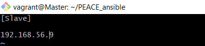

# Objective

- Automate the provisioning of two Ubuntu-based servers, named “Master” and “Slave”, using Vagrant.
- On the Master node, create a bash script to automate the deployment of a LAMP (Linux, Apache, MySQL, PHP) stack.
- This script should clone a PHP application from GitHub, install all necessary packages, and configure Apache web server and MySQL. 
- Ensure the bash script is reusable and readable.

**Using an Ansible playbook:**

- Execute the bash script on the Slave node and verify that the PHP application is accessible through the VM’s IP address (take screenshot of this as evidence)
- Create a cron job to check the server’s uptime every 12 am.


**PHP Laravel GitHub Repository:**

https://github.com/laravel/laravel

# PROJECT STEPS :-

- It is important first of all to configure your Master Ubuntu-based Servers. Install your virtual machine and run the command, ```vagrant init ubuntu/focal64```. But before you do a ```vagrant up```, open the configuration file, ```vim Vagrantfile``` and make sure to configure the uncommented parts of this vagrantfile as seen below;


*BashScript file to automate LAMP Stack and deploy on the slave server*
```
#!/bin/bash

# Update and upgrade packages
sudo apt update
sudo apt upgrade -y
sudo apt -y install software-properties-common

# Add PHP repository and install PHP 8.2
sudo add-apt-repository -y ppa:ondrej/php

sudo apt install php8.2 -y

# Install PHP extensions
sudo apt install php8.2-curl php8.2-dom php8.2-mbstring php8.2-xml php8.2-mysql zip unzip -y

# Install Apache
sudo apt install apache2 -y

# Enable Apache modules
sudo a2enmod rewrite

# Restart Apache
sudo systemctl restart apache2

# Install Composer
cd /usr/bin
sudo curl -sS https://getcomposer.org/installer | sudo php

sudo mv composer.phar composer

# Clone Laravel repository
cd ~
cd /var/www
sudo git clone https://github.com/laravel/laravel

# Navigate to Laravel directory
cd laravel/

# Install dependencies
yes | sudo composer install --optimize-autoloader --no-dev


# Change ownership of directories
sudo chown -R www-data storage
sudo chown -R www-data bootstrap/cache

# Configure Apache virtual host
sudo tee /etc/apache2/sites-available/laravel.conf > /dev/null <<EOF
<VirtualHost *:80>
    ServerName localhost
    DocumentRoot /var/www/laravel/public

    <Directory /var/www/laravel/public>
        Options Indexes FollowSymLinks
        AllowOverride All
        Require all granted
    </Directory>

    ErrorLog \${APACHE_LOG_DIR}/laravel-error.log
    CustomLog \${APACHE_LOG_DIR}/laravel-access.log combined
</VirtualHost>
EOF

# Enable the new virtual host
sudo a2ensite laravel.conf

sudo a2dissite 000-default.conf

# Restart Apache
sudo systemctl restart apache2

# Install MariaDB
sudo apt install mariadb-server -y

# Start MariaDB service
sudo systemctl start mysql

# Secure MariaDB installation
sudo mysql_secure_installation <<EOF
echo ""
N
Y
Y
Y
Y
EOF

# Log in to mariaDB
sudo mysql <<EOF
CREATE DATABASE laraveldb;
CREATE USER 'PEACE'@'localhost' IDENTIFIED BY 'ritzypeace';
GRANT ALL PRIVILEGES ON laraveldb.* TO 'PEACE'@'localhost';
FLUSH PRIVILEGES;
exit
EOF

# Configure Laraveldb .env file
# Set environment variables for Laraveldb
echo 'APP_NAME=Laraveldb' | sudo tee -a /var/www/laravel/.env
echo 'APP_ENV=local' | sudo tee -a /var/www/laravel/.env
echo 'APP_KEY=' | sudo tee -a /var/www/laravel/.env
echo 'APP_DEBUG=true' | sudo tee -a /var/www/laravel/.env
echo 'APP_URL=localhost' | sudo tee -a /var/www/laravel/.env
echo '' | sudo tee -a /var/www/laravel/.env
echo 'DB_CONNECTION=mysql' | sudo tee -a /var/www/laravel/.env
echo 'DB_HOST=127.0.0.1' | sudo tee -a /var/www/laravel/.env
echo 'DB_PORT=3306' | sudo tee -a /var/www/laravel/.env
echo 'DB_DATABASE=laraveldb' | sudo tee -a /var/www/laravel/.env
echo 'DB_USERNAME=PEACE' | sudo tee -a /var/www/laravel/.env
echo "DB_PASSWORD=ritzypeace" | sudo tee -a /var/www/laravel/.env


sudo php artisan key:generate

# Run Laravel migrations
sudo php artisan migrate

# Restart Apache
sudo systemctl restart apache2

```

1. Input the ip address of your slave node on your browser to get the laravel homepage interface below;


.png)


2. Create a playbook to execute your bashscript on the slave server. Run the playbook with the command; ```ansible-playbook -i host playbook.yaml```. Always replace the 'host' with whatever title you gave to your inventory file. Below this is screen of the successful running of the playbook..


readme.md